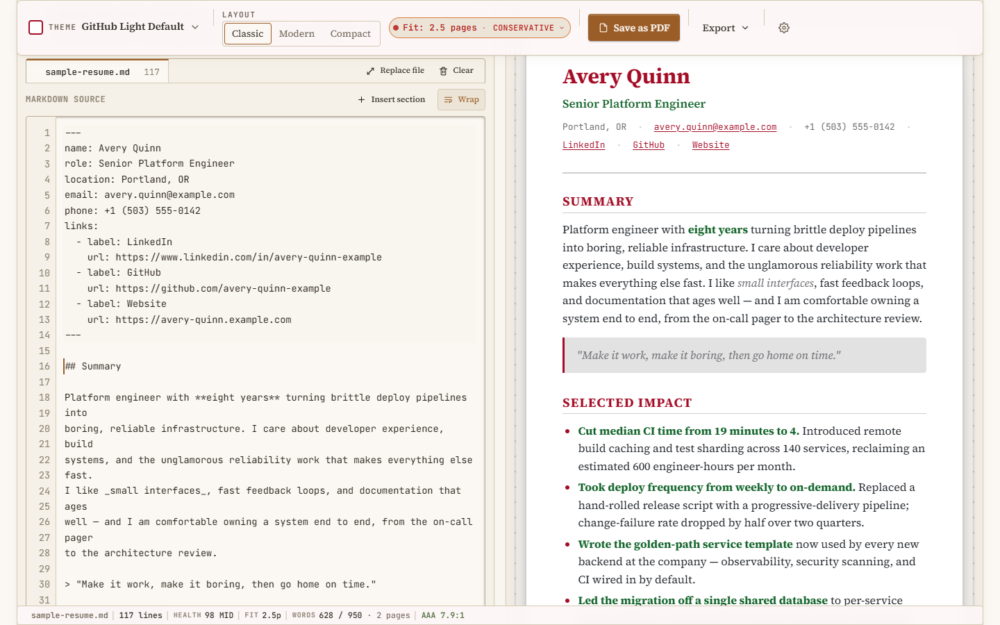

# Works on My Resume

**Markdown in. Resume out. No servers harmed.**

A static, local-first Markdown resume renderer. Bring a Markdown resume,
preview it instantly, dress it in one of 465 OKLCH terminal themes, print it,
or export it — all in your browser. There is no backend, no account, and no
analytics. Your resume never leaves your machine.

**[Try it live](https://qorexdevs.github.io/works-on-my-resume/)** — nothing
to install.



## What it does

- **Bring your Markdown.** Upload a `.md` file or paste/type Markdown directly
  into the editor.
- **Preview instantly.** The rendered resume updates as you edit.
- **Cycle themes.** Browse 465 OKLCH terminal color themes, normalized into
  semantic resume tokens, and apply any of them with one click.
- **Print.** A print-friendly stylesheet produces clean, ink-aware output via
  your browser's native print dialog — no PDF service involved.
- **Export.** Download the raw Markdown, a fully self-contained standalone
  HTML file, or just the active theme as a `.css` file.

Everything above happens locally, in the page.

## Privacy

This is a fully static, local-first application.

- Resume content is parsed, sanitized, rendered, and exported **entirely in
  the browser**.
- The app does **not** upload, store, or transmit resume content — there is no
  server to send it to.
- The one network request the app can make is the explicit **Import from
  Gist**: a single anonymous GET to GitHub's public Gists API, issued only
  when you paste a gist URL and click Import. It carries no resume content
  outbound — the request is just the gist id.
- Shareable theme links carry **only the selected theme** (its slug). They
  never contain resume content.
- Nothing is persisted across page reloads by default. Closing or reloading
  the tab discards your in-progress resume, unless you switch on the opt-in
  "Remember this resume on this device" toggle — that saves the Markdown to
  your browser's local storage and nowhere else, and turning it off deletes
  the saved copy along with any version snapshots.
- There are no analytics, trackers, or third-party scripts.

## Security

Uploaded and pasted Markdown is treated as **untrusted input** and is run
through a defensive pipeline before anything reaches the DOM:

1. **`js-yaml`** — parses the optional YAML frontmatter that a small regex
   splits off the top of the Markdown source.
2. **`marked`** — renders the Markdown body to HTML with GitHub Flavored
   Markdown (GFM) enabled.
3. **`DOMPurify`** — sanitizes the rendered HTML before it is inserted into
   the page.

The sanitization step blocks dangerous constructs, including:

- Tags such as `script`, `iframe`, `object`, `embed`, and `form`.
- Inline event-handler attributes (`onclick`, `onerror`, and similar).
- `javascript:` URLs.
- Inline `style` attributes.

In addition, a **Content Security Policy** is applied via a `<meta>` tag in
the base layout: `script-src` is restricted to the app's own origin,
`object-src` is `none`, `form-action` is `none`, and `frame-ancestors` is
`none`. The exported standalone HTML file is likewise dependency-free — it
contains no scripts and makes no network requests.

## Features

- Markdown resume rendering with GFM support.
- File upload **and** paste/type editing.
- Import from a public GitHub Gist — paste a gist URL, pick a file.
- Live preview.
- 465 OKLCH terminal themes — every one clears a 7:1 body-text contrast
  floor, so all of them are safe to print.
- Three layout templates: Classic, Modern, and Compact.
- Print-friendly output with a dedicated `@media print` stylesheet.
- Page-fit indicator — estimated printed page count, per-section heights,
  and a page-break ruler overlay.
- Resume Health panel — a composite score with findings, tuned to a
  junior / mid / senior rubric.
- Tailor for a role — paste a job description and see your keyword overlap
  (tech / soft / domain), with matches highlighted in the preview. Computed
  locally; the JD never leaves the page.
- Local version snapshots for A/B-ing resume variants (opt-in).
- Three export formats: Markdown (`.md`), standalone HTML (`.html`), and
  theme CSS (`.css`).
- JSON Resume import and export, plus an ATS plain-text export mode.
- Shareable theme-only links.
- Strict TypeScript throughout; no runtime backend.

## Writing your resume

New to authoring a resume for this tool? See
[`docs/writing-your-resume.md`](docs/writing-your-resume.md) — a practical
guide to the optional YAML frontmatter, recommended body structure, the
supported (and sanitized-away) Markdown features, and tips for themes and
printing. The bundled [`public/sample-resume.md`](public/sample-resume.md)
is a working reference for the recommended structure.

## Local development

Requires Node.js `>= 22.12.0`.

```sh
# Install dependencies
npm install

# Start the dev server (default: http://localhost:4321)
npm run dev
```

### Build & preview

```sh
# Produce the static site in dist/
npm run build

# Serve the built output locally
npm run preview
```

### Quality scripts

```sh
# Type-check Astro, TypeScript, and components
npm run check

# Lint the project
npm run lint

# Format the project with Prettier
npm run format
```

### Testing

End-to-end coverage is driven by Playwright (`npm run test:e2e`) against the
`astro preview` server. Alongside the per-feature specs the suite includes an
accessibility gate (`tests/e2e/a11y.spec.ts`) that runs
[`@axe-core/playwright`](https://github.com/dequelabs/axe-core-npm/tree/develop/packages/playwright)
against every canonical interactive state — the empty studio, the loaded
sample, the theme picker, the Tailor-for-a-role disclosure, the page-fit
popover, and the snapshots menu — plus a print-media pass on a saturated
theme. The gate fails CI on any `serious` or `critical` WCAG 2.1 A/AA
violation; `moderate` and `minor` findings are logged for follow-up but do
not break the build. New UI work is expected to keep this gate green.

**Bundle size budget**: `npm run size` runs `size-limit` against the three
biggest chunks (`ResumeStudio.*.js`, `client.*.js`, `themes.*.js`). CI's
[`perf-budget`](.github/workflows/perf-budget.yml) workflow enforces the
same caps on every PR. To raise a cap, edit
[`.size-limit.cjs`](.size-limit.cjs) and explain why in the commit message.

## Deployment

The site is built as fully static output and deployed to **GitHub Pages** via
GitHub Actions. The workflow lives at
[`.github/workflows/deploy.yml`](.github/workflows/deploy.yml): it builds the
site with `withastro/action` and publishes it with `actions/deploy-pages` on
every push to `main` (and on manual dispatch).

The published site lives at
<https://qorexdevs.github.io/works-on-my-resume/>. The `site` and
`base` values are configured in `astro.config.mjs`.

## Theme system

Themes are sourced from the
[`@williamzujkowski/oklch-terminal-themes`](https://github.com/williamzujkowski/oklch-terminal-themes)
dataset of 545 OKLCH terminal color schemes, vendored into the repository so
the app needs no network access at runtime. The 80 schemes whose body text
fell below the 7:1 resume-safe contrast threshold are dropped from the
vendored dataset, leaving **465 themes** — every one of them comfortably
legible.

Each terminal theme is normalized into a small set of **semantic resume
tokens** (background, foreground, muted, accent, accent-2, border, card, code
background). The resume renderer consumes only these tokens — never raw
terminal color slots — so any theme can drive the layout. Each theme also
ships precomputed WCAG contrast metadata, surfaced as the contrast badge
next to the theme name.

## Roadmap

The MVP focuses on render, theme, print, and export. Post-MVP work is tracked
in the repository's **GitHub issues and milestones**, and includes ideas such
as:

- Additional layout templates.
- ZIP export bundling Markdown, HTML, and theme CSS together.

## Tech stack

- **[Astro](https://astro.build/)** — static site framework.
- **TypeScript** — strict mode throughout.
- **React** — used as a single interactive island for the editor/preview UI.
- **[marked](https://marked.js.org/)** — Markdown → HTML rendering (GFM).
- **[js-yaml](https://github.com/nodeca/js-yaml)** — YAML frontmatter parsing.
- **[DOMPurify](https://github.com/cure53/DOMPurify)** — HTML sanitization.

## License

Released under the [MIT License](LICENSE).
